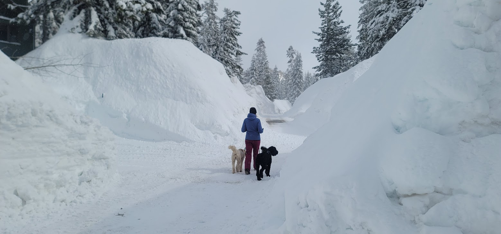
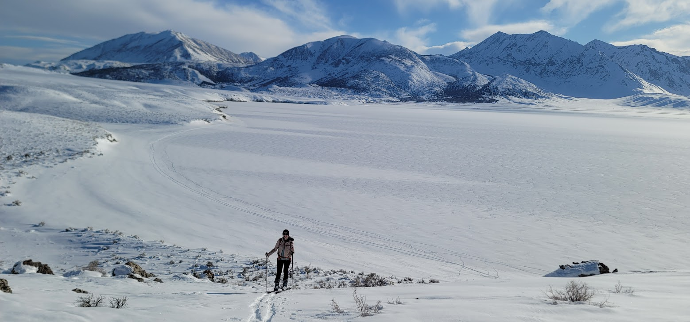

export const meta = {
  published: '2023-12-20T22:46:50.595Z',
  author: 'The Rubernelius Household',
  title: 'Happy New Year',
  tags: ['2023'],
  hide_toc: false
}

# Happy New Year!

This was quite the busy past year for us in the Rubernelius household. We survived a record Mammoth winter, spent nearly a month travelling in Japan, made major progress on our off-grid ambitions, and most importantly welcomed a very special new arrival.

 

## Surviving Winter

We knew moving to Mammoth that it could really snow. Sarah's entire interview experience was one continuous whiteout here back in 2019 - she had to take it on faith that there were even mountains in the area after my repeated reassurances.

 

Of course, after we moved in 2019 California had its three driest consecutive years on record, so we had spent a lot of time wishing it would actually snow more. But nothing could have prepared us (or anyone else) for the record wet year of 22/23

{/*

*/}

<Carousel items={['img/winter.jpg', 'img/winter2.jpg', 'video/crater_lake.mp4']}/>

{/*

<video width={320} height={240} controls>
  <VideoSource src='video/crater_lake.mp4' type='video/mp4'/>
</video>

*/}
