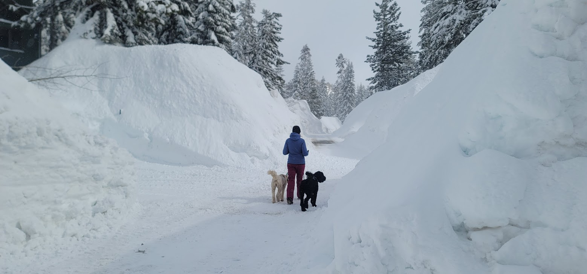
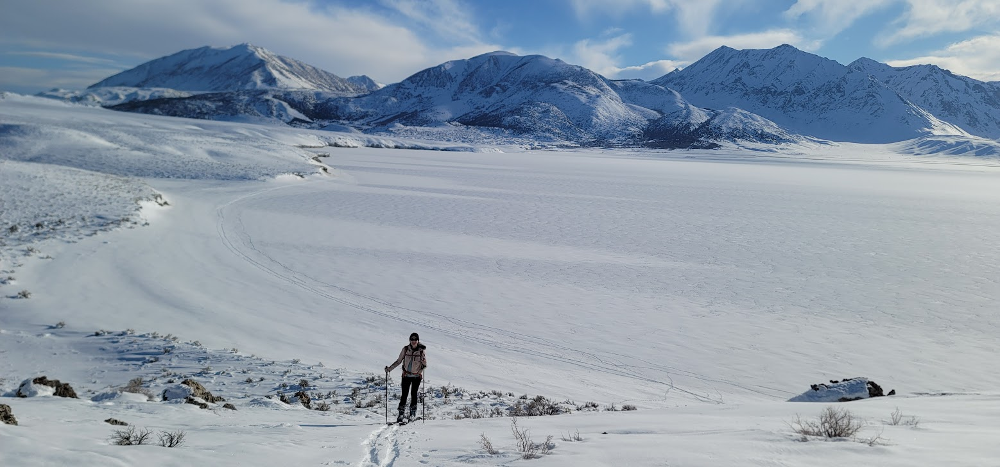

export const meta = {
  published: '2023-12-20T22:46:50.595Z',
  author: 'The Rubernelius Household',
  title: 'Happy New Year',
  tags: ['2023'],
  hide_toc: false
}

# Happy New Year!

This was quite the busy year for us in the Rubernelius household. A record winter, month in Japan, major progress on our off-grid ambitions, and most importantly a very special new arrival.

 

## Surviving the Winter

We knew moving to Mammoth that it could really snow. Sarah's entire interview experience was one continuous whiteout here back in 2019 - she had to take it on faith that there were even mountains in the area after my repeated reassurances.

California had the three driest consecutive years on record after we moved, but still managed to drop a couple 10ft storms. But nothing prepared us (or anyone else) for the record wet year of 22/23

{/*

*/}

<Carousel images={['img/winter.jpg', 'img/winter2.jpg']}/>
